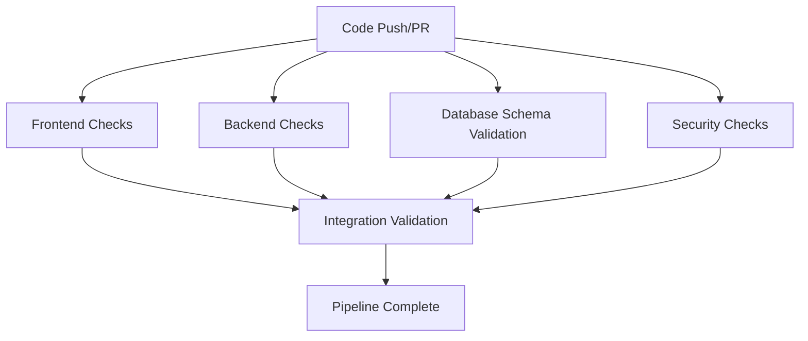

# DBMS Project CI Pipeline Documentation

## 🎯 Overview

This CI pipeline is designed for **academic-grade validation** of a DBMS self-healing project. It prioritizes **safety, correctness, and educational value** over speed or deployment automation.

## 🏗️ Pipeline Architecture

### Trigger Conditions
- **Push events**: `main`, `develop`, `feature/*` branches
- **Pull requests**: targeting `main` or `develop`
- **Concurrency**: One run per branch (cancels previous runs)

### Pipeline Stages



## 🔍 Detailed Stage Breakdown

### 1️⃣ Frontend Validation (`frontend-checks`)

**Purpose**: Ensure Next.js application quality and buildability

**Checks Performed**:
- ✅ **TypeScript Compilation**: `tsc --noEmit` for type safety
- ✅ **ESLint**: Code quality and potential bug detection
- ✅ **Prettier**: Code formatting consistency
- ✅ **Production Build**: `next build` to ensure deployability

**Failure Conditions**:
- TypeScript type errors
- ESLint rule violations
- Formatting inconsistencies
- Build failures

**Working Directory**: `./dbms-self-healing-ui`

### 2️⃣ Backend Validation (`backend-checks`)

**Purpose**: Validate Python Flask backend code quality

**Checks Performed**:
- ✅ **Syntax Validation**: `python -m compileall` for syntax errors
- ✅ **Code Quality**: Flake8 linting for Python best practices
- ✅ **Unit Tests**: pytest execution for functionality validation
- ✅ **Import Validation**: Ensure all dependencies are importable

**Failure Conditions**:
- Python syntax errors
- Import errors
- Failing unit tests
- Code quality violations

**Working Directory**: `./dbms-backend`

### 3️⃣ Database Schema Validation (`database-schema-validation`)

**Purpose**: CRITICAL - Validate database schema correctness and safety

**Infrastructure**:
- **MySQL 8.0** service container
- **Temporary database**: `dbms_self_healing_test`
- **Isolated environment**: No external connections

**Validation Steps**:
1. **Schema Loading**: Load `DATABASE_THINGS/schema_refactored.sql`
2. **Table Verification**: Confirm all expected tables exist
3. **Foreign Key Validation**: Verify constraint relationships
4. **Integrity Check**: Run `ANALYZE TABLE` and `CHECK TABLE`

**Safety Measures**:
- ❌ **NO data insertion** - schema structure only
- ❌ **NO destructive operations** - read-only validation
- ❌ **NO healing actions** - academic safety first

**Failure Conditions**:
- Schema file missing or unreadable
- SQL syntax errors
- Missing tables or constraints
- Foreign key relationship failures

### 4️⃣ Security Validation (`security-checks`)

**Purpose**: Prevent accidental credential exposure and ensure SQL safety

**Security Scans**:
- 🔍 **Hardcoded Secrets**: Scan for passwords, API keys, tokens
- 🔍 **Environment Safety**: Validate `.env` file structure
- 🔍 **SQL Injection Prevention**: Check for dangerous SQL patterns
- 🔍 **Safe SQL Operations**: Ensure `DROP` statements use `IF EXISTS`

**Failure Conditions**:
- Hardcoded credentials detected
- Dangerous SQL patterns found
- Missing safety guards in SQL
- Committed `.env` files

### 5️⃣ Integration Validation (`integration-check`)

**Purpose**: Final validation and project structure verification

**Validation Steps**:
- 📁 **Project Structure**: Verify required files exist
- 📋 **Documentation**: Ensure README and docs are present
- 🎯 **Integration Summary**: Confirm all stages passed

**Dependencies**: Requires all previous stages to pass

## 🛠️ Configuration Files

### Backend Configuration
- **`pytest.ini`**: Test discovery and execution settings
- **`.flake8`**: Python code quality standards
- **`test_ci_validation.py`**: CI-specific validation tests

### Frontend Configuration
- **`package.json`**: Scripts for lint, format, build
- **`eslint.config.mjs`**: ESLint rules and settings
- **`.prettierrc`**: Code formatting standards

### Repository Configuration
- **`CODEOWNERS`**: Review requirements for critical files
- **`pull_request_template.md`**: Standardized PR format

## 🚨 Failure Scenarios and Troubleshooting

### Common Failure Patterns

| Stage | Common Issue | Solution |
|-------|-------------|----------|
| Frontend | TypeScript errors | Fix type definitions, update imports |
| Frontend | Build failures | Check Next.js configuration, dependencies |
| Backend | Import errors | Verify `requirements.txt`, Python path |
| Backend | Test failures | Fix failing tests, update test data |
| Database | Schema errors | Validate SQL syntax, foreign keys |
| Database | Missing tables | Check table creation statements |
| Security | Hardcoded secrets | Move to environment variables |
| Security | Dangerous SQL | Add safety guards (`IF EXISTS`) |

### Debugging Steps

1. **Check CI Logs**: Each step provides detailed output
2. **Local Reproduction**: Run the same commands locally
3. **Dependency Issues**: Verify `package.json` and `requirements.txt`
4. **Schema Validation**: Test SQL files against local MySQL
5. **Security Scans**: Use `grep` commands from CI locally

## 🎓 Academic Standards

### Safety First Principles
- **No Production Data**: Only test/mock data allowed
- **No Real Credentials**: All secrets must be CI-safe
- **No Destructive Operations**: Read-only database validation
- **No Auto-Deployment**: Manual review required

### Educational Value
- **Clear Documentation**: Every step explained
- **Reproducible Results**: Consistent across environments
- **Learning Opportunities**: Failure messages are educational
- **Best Practices**: Industry-standard tools and patterns

## 🔧 Local Development

### Running CI Checks Locally

```bash
# Frontend checks
cd dbms-self-healing-ui
npm ci
npx tsc --noEmit
npm run lint
npm run format:check
npm run build

# Backend checks
cd dbms-backend
pip install -r requirements.txt
python -m compileall .
flake8 .
pytest -v

# Database validation (requires local MySQL)
mysql -u root -p < DATABASE_THINGS/schema_refactored.sql
```

### Pre-Commit Recommendations

1. Run TypeScript compilation: `npx tsc --noEmit`
2. Format code: `npm run format`
3. Run linting: `npm run lint`
4. Execute tests: `pytest`
5. Validate schema: Load into local MySQL

## 📊 Performance Characteristics

- **Average Runtime**: 8-12 minutes
- **Parallel Execution**: Frontend and backend run simultaneously
- **Resource Usage**: Moderate (MySQL service + Node.js + Python)
- **Caching**: npm and pip dependencies cached between runs

## 🔄 Maintenance

### Regular Updates Required
- **Dependencies**: Keep Node.js, Python, MySQL versions current
- **Security Scans**: Update secret detection patterns
- **Test Coverage**: Add tests for new functionality
- **Documentation**: Keep this README synchronized with changes

### Version Compatibility
- **Node.js**: 20.x LTS (specified in CI)
- **Python**: 3.11+ (specified in CI)
- **MySQL**: 8.0 (service container)
- **Ubuntu**: 22.04 LTS (runner environment)

---

## 📞 Support

For CI pipeline issues:
1. Check this documentation first
2. Review CI logs for specific error messages
3. Test commands locally to reproduce issues
4. Consult with DevOps team for infrastructure problems

**Remember**: This CI pipeline prioritizes academic safety and educational value over speed or convenience. Every check serves a purpose in maintaining project quality and safety standards.