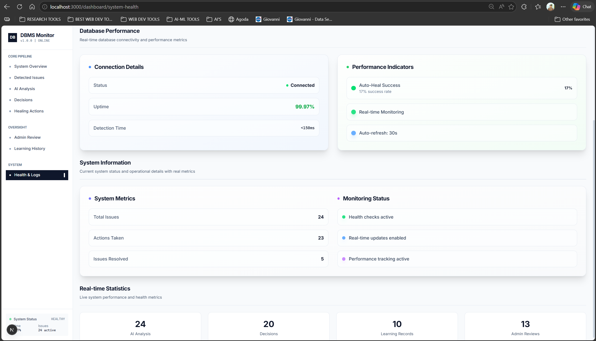
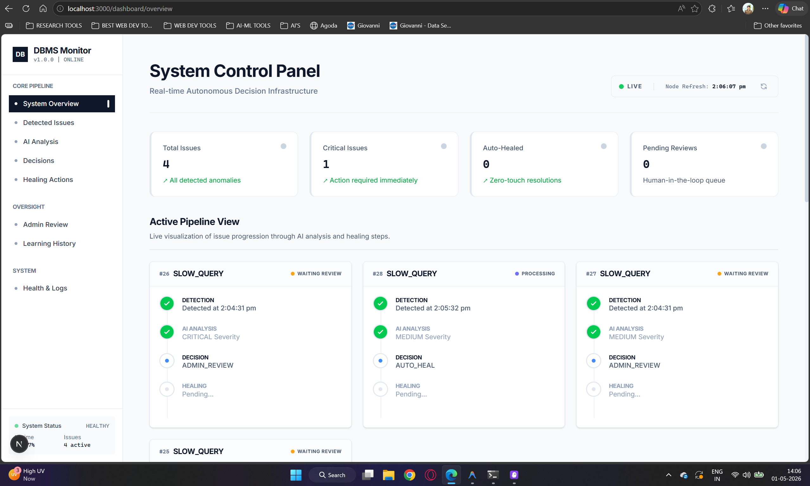
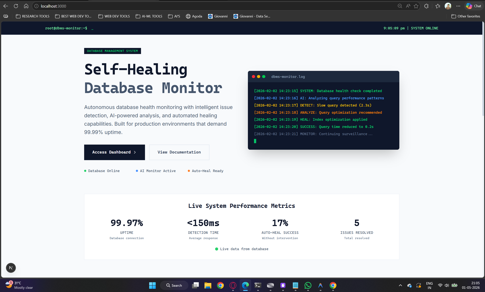
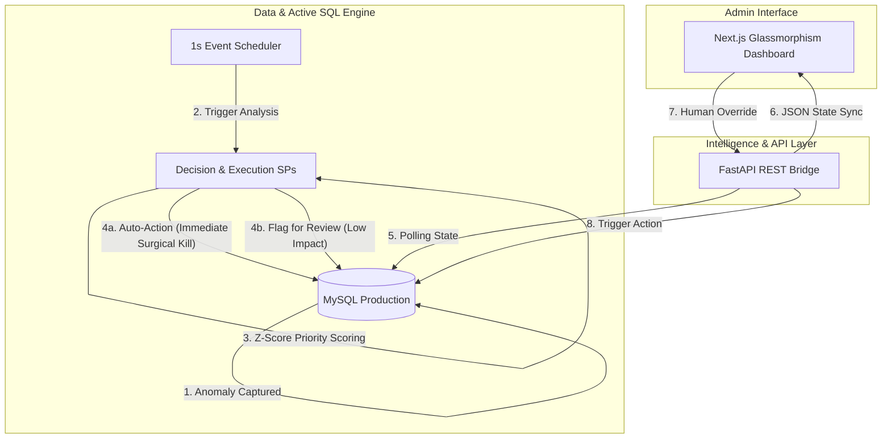

 

  <h1>🔮 AI-Powered DBMS Self-Healing Engine</h1>

  
<b>The state-of-the-art anomaly resolution framework bridging modern web technologies and a self-repairing SQL transaction pipeline.</b>

  

    
    
    
    
    
  

---

## 🌟 The Vision

Manual database administration is a bottleneck. In high-concurrency environments, deadlocks, connection overloads, and slow queries can cascade into system-wide outages before a DBA even receives an alert. 

Our **Self-Healing Engine** monitors the database pulse and takes **autonomous, zero-latency corrective action** before minor issues become catastrophic failures.

---

## ✨ System Showcase

<table>
  <tr>
    <td width="50%" align="center">
      
       
      <b>Real-Time Command Center</b>
       
      Live metrics, issue detection, and system health monitoring
    </td>
    <td width="50%" align="center">
      
       
      <b>Intelligent Issue Detection</b>
       
      Automated anomaly classification with severity scoring
    </td>
  </tr>
  <tr>
    <td width="50%" align="center">
      
       
      <b>AI-Powered Analysis</b>
       
      Z-score confidence and risk assessment in real-time
    </td>
    <td width="50%" align="center">
      
       
      <b>Autonomous Decision Engine</b>
       
      Auto-heal vs. admin review routing with confidence thresholds
    </td>
  </tr>
  <tr>
    <td width="50%" align="center">
      
       
      <b>Surgical Healing Execution</b>
       
      Real-time action tracking with verification status
    </td>
    <td width="50%" align="center">
      
       
      <b>Human-in-the-Loop Control</b>
       
      Admin review queue for ambiguous cases requiring validation
    </td>
  </tr>
  <tr>
    <td colspan="2" align="center">
      
       
      <b>Continuous Learning Ecosystem</b>
       
      Feedback loop tracking outcomes and improving decision confidence over time
    </td>
  </tr>
</table>

---

## 🎯 Key Features

<table>
  <tr>
    <td width="33%" align="center">
      <h3>⚡ Sub-Second Detection</h3>
      
MySQL Event Scheduler polls every 1 second, detecting anomalies before they cascade into system failures

    </td>
    <td width="33%" align="center">
      <h3>🧠 AI-Driven Decisions</h3>
      
Z-score confidence scoring and baseline analysis determine auto-heal vs. human review routing

    </td>
    <td width="33%" align="center">
      <h3>🔧 Surgical Execution</h3>
      
Targeted process kills using sys.innodb_lock_waits mapping—no blind terminations

    </td>
  </tr>
  <tr>
    <td width="33%" align="center">
      <h3>🛡️ Safety Guards</h3>
      
10-second race condition protection and iterative relief loops prevent over-correction

    </td>
    <td width="33%" align="center">
      <h3>📊 Real-Time Dashboard</h3>
      
Glassmorphism UI with live metrics, pipeline visualization, and admin override controls

    </td>
    <td width="33%" align="center">
      <h3>🔄 Continuous Learning</h3>
      
Feedback loop tracks outcomes and adjusts confidence thresholds over time

    </td>
  </tr>
</table>

---

## 🚀 Quick Navigation

Explore our comprehensive documentation suite for deep technical insights:

| 📍 Topic | 📁 Documentation Link |
| :--- | :--- |
| **Blueprint** | [System Architecture](./docs/Architecture.md) |
| **Logic** | [The Self-Healing Engine](./docs/Healing_Engine_Design.md) |
| **Database** | [Database Design & ERD](./docs/Database_Design.md) |
| **Guides** | [Setup & Installation Guide](./docs/Setup_Guide.md) |
| **API** | [Technical API Reference](./docs/API_Documentation.md) |

---

## 📊 Event-Driven Architecture

Our Phase 7 architecture utilizes a pure SQL Event-Driven model, ensuring maximum performance without the latency of external Python orchestration.

---

## 🛠️ Tech Stack

*   **Frontend**: Next.js 14, Tailwind CSS, Recharts, Lucide Icons.
*   **Backend**: Python 3.14, FastAPI, SQLAlchemy, Pydantic.
*   **Database**: MySQL 8.0 with Native Event Scheduler and Stored Procedures.

---

## 🛡️ Safety & Security Guarantees

To prevent accidental data loss, the engine operates under strict **Safety Guards**:
- **Surgical Process Kills**: Deadlock and overload resolutions specifically target blocking `trx_mysql_thread_id` PIDs, never blindly terminating threads.
- **Iterative Relief Loops**: Overload reductions happen iteratively until the system stabilizes beneath safe thresholds.
- **10-Second Race Guard**: Aborts healing executions if the anomaly is older than 10 seconds to avoid fighting "ghost" issues.

---

  
© 2026 DBMS Self-Healing Team. Built for performance, designed for resilience.

