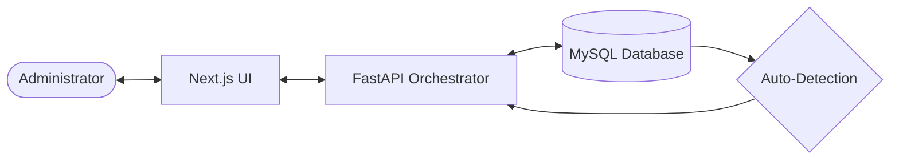

# 🔮 AI-Powered DBMS Self-Healing Engine

> **The state-of-the-art anomaly resolution framework bridging modern web technologies and a self-repairing SQL transaction pipeline.**

---

## 🌟 The Vision
Manual database administration is a bottleneck. In high-concurrency environments, deadlocks and slow queries can cascade into system-wide outages. Our **Self-Healing Engine** monitors the database pulse and takes autonomous corrective action before minor issues become catastrophic failures.

### Key Pillars:
- **Autonomous Detection**: Monitoring triggers capture issues in real-time.
- **AI-Driven Confidence**: Logic engines assign risk scores to every anomaly.
- **One-Click Override**: Premium Admin UI for human-in-the-loop validation.
- **Safety First**: Deterministic rulebooks prevent dangerous mutations.

---

## 🚀 Quick Navigation

Explore our comprehensive documentation suite for deep technical insights:

| 📍 Topic | 📁 Documentation Link |
| :--- | :--- |
| **Blueprint** | [System Architecture](./docs/Architecture.md) |
| **Logic** | [The Self-Healing Engine](./docs/Healing_Engine_Design.md) |
| **Database** | [Database Design & ERD](./docs/Database_Design.md) |
| **Guides** | [Setup & Installation Guide](./docs/Setup_Guide.md) |
| **API** | [Technical API Reference](./docs/API_Documentation.md) |
| **Design** | [UI/UX Design System](./docs/UI_Design_System.md) |

---

## 📊 High-Level Architecture

---

## ✨ Primary Features

### 1. Adaptive Rulebook
A dynamic scoring system that knows precisely when a `DEADLOCK` can be auto-healed (95% confidence) vs when a `SLOW_QUERY` requires a manual architectural review.

### 2. Premium Admin Control Center
A stunning, **Glassmorphism-styled dashboard** providing:
- Real-time transaction monitoring.
- Aggregate health statistics.
- Interactive decision approval/rejection grids.

### 3. Integrated Learning Module
As the human administrator approves or rejects healing actions, the internal meta-data incrementally adjusts confidence scores, evolving toward a fully autonomous "Zero-Human" state.

---

## 🛠️ Tech Stack
- **Frontend**: Next.js 14, Tailwind CSS, Lucide Icons, Shadcn UI.
- **Backend**: Python 3.12, FastAPI, SQLAlchemy, Pydantic.
- **Database**: MySQL 8.0 with Native SQL Triggering.

---

## 🛡️ Safety & Security
To prevent accidental data loss, the engine operates under strict **Safety Guards**:
- Blocked DDL operations (DROP, TRUNCATE).
- Simulated healing execution (Log-only mode).
- Deterministic, verifiable rule hierarchies.

---

© 2026 DBMS Self-Healing Team. Built for performance, designed for resilience.