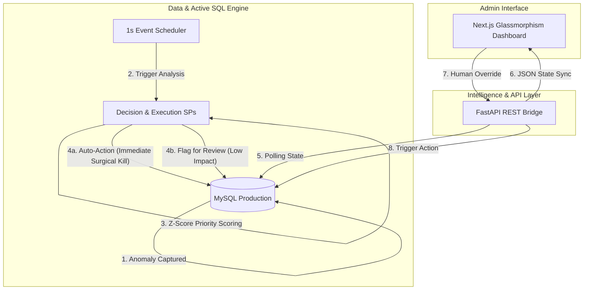

  

  <h1>🔮 AI-Powered DBMS Self-Healing Engine</h1>

  
<b>The state-of-the-art anomaly resolution framework bridging modern web technologies and a self-repairing SQL transaction pipeline.</b>

  

    
    
    
    
    
  

---

## 🌟 The Vision

Manual database administration is a bottleneck. In high-concurrency environments, deadlocks, connection overloads, and slow queries can cascade into system-wide outages before a DBA even receives an alert. 

Our **Self-Healing Engine** monitors the database pulse and takes **autonomous, zero-latency corrective action** before minor issues become catastrophic failures.

---

## ✨ System Showcase

### 1. The Premium Command Center
The frontend is built with Next.js 14, Tailwind CSS, and Shadcn UI, featuring a stunning **Glassmorphism aesthetic**. It provides real-time transaction monitoring, aggregate health statistics, and an interactive grid for decision management.

  

### 2. Surgical, Real-Time Execution
The engine doesn't just log issues—it fixes them. Using a native **MySQL Event Scheduler (1s interval)**, the system bypasses async queues for critical issues. 
*   **Deadlocks**: Surgically maps `sys.innodb_lock_waits` to exact blocking PIDs.
*   **Overloads**: Initiates an Iterative Relief Loop, selectively killing queries until the system stabilizes.

  

### 3. Dynamic Priority Scoring & Human-in-the-Loop
Not all anomalies are equal. The SQL logic engines assign intelligent risk scores based on **Z-score confidence** and **actual system impact**. High-priority issues are auto-healed instantly, while ambiguous anomalies are sent to the Admin Review queue for human validation.

  

---

## 🚀 Quick Navigation

Explore our comprehensive documentation suite for deep technical insights:

| 📍 Topic | 📁 Documentation Link |
| :--- | :--- |
| **Blueprint** | [System Architecture](./docs/Architecture.md) |
| **Logic** | [The Self-Healing Engine](./docs/Healing_Engine_Design.md) |
| **Database** | [Database Design & ERD](./docs/Database_Design.md) |
| **Guides** | [Setup & Installation Guide](./docs/Setup_Guide.md) |
| **API** | [Technical API Reference](./docs/API_Documentation.md) |

---

## 📊 Event-Driven Architecture

Our Phase 7 architecture utilizes a pure SQL Event-Driven model, ensuring maximum performance without the latency of external Python orchestration.

---

## 🛠️ Tech Stack

*   **Frontend**: Next.js 14, Tailwind CSS, Recharts, Lucide Icons.
*   **Backend**: Python 3.14, FastAPI, SQLAlchemy, Pydantic.
*   **Database**: MySQL 8.0 with Native Event Scheduler and Stored Procedures.

---

## 🛡️ Safety & Security Guarantees

To prevent accidental data loss, the engine operates under strict **Safety Guards**:
- **Surgical Process Kills**: Deadlock and overload resolutions specifically target blocking `trx_mysql_thread_id` PIDs, never blindly terminating threads.
- **Iterative Relief Loops**: Overload reductions happen iteratively until the system stabilizes beneath safe thresholds.
- **10-Second Race Guard**: Aborts healing executions if the anomaly is older than 10 seconds to avoid fighting "ghost" issues.

---

  
© 2026 DBMS Self-Healing Team. Built for performance, designed for resilience.

