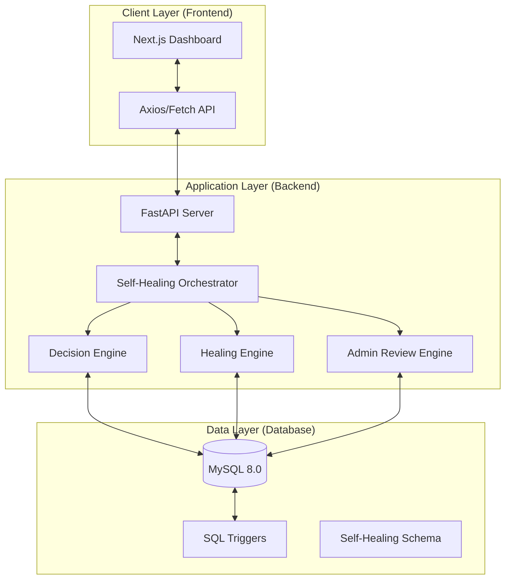

# 🏛️ System Architecture

This document provides a high-level technical overview of the **AI-Powered DBMS Self-Healing Engine**. The system is designed using a decoupled, multi-tier architecture to ensure scalability, safety, and a premium user experience.

---

## 🗺️ System Overview

The system consists of three primary layers:
1.  **Frontend (UI)**: Built with Next.js 14, providing a real-time monitoring and administrative control dashboard.
2.  **Backend (API)**: A FastAPI-driven service that orchestrates the detection, analysis, and healing workflows.
3.  **Database (Storage & Logic)**: A MySQL 8.0 instance containing the data schema, historical logs, and native triggers that bootstrap the healing process.

### 🏗️ Architecture Diagram

---

## 💻 Technology Stack

| Layer | Technology | Role |
| :--- | :--- | :--- |
| **Frontend** | [Next.js 14](https://nextjs.org/) | React framework for the dashboard UI. |
| **Styling** | [Tailwind CSS](https://tailwindcss.com/) | Utility-first CSS for glassmorphism and modern design. |
| **Backend** | [FastAPI](https://fastapi.tiangolo.com/) | High-performance Python API framework. |
| **Database** | [MySQL 8.0](https://www.mysql.com/) | Relational database with trigger-based detection. |
| **Validation** | [Pydantic](https://docs.pydantic.dev/) | Type safety and data validation for API payloads. |
| **ORM** | [SQLAlchemy](https://www.sqlalchemy.org/) | SQL Toolkit and Object Relational Mapper. |

---

## 🔄 Core Data Flow

The lifecycle of an anomaly resolution follows this deterministic path:

1.  **Detection**: MySQL native triggers or the backend monitoring engine identifies a database anomaly (e.g., a deadlock).
2.  **Ingestion**: The anomaly is logged into the `detected_issues` table.
3.  **Decision**: The **Decision Engine** queries the `healing_rulebook` to classify the issue and assign a confidence score.
4.  **Pivot**:
    - **Auto-Heal**: If confidence > 85%, the **Healing Engine** executes a simulated corrective action.
    - **Admin Review**: If confidence < 85%, the **Admin Review Engine** flags it for human intervention in the UI.
5.  **Resolution**: The action status is updated, and the record moves to `learning_history`.

---

## 🔒 Safety & Isolation

To prevent accidental data corruption during development or simulation:
- **Simulated Execution**: Healing actions (like `KILL_CONNECTION` or `ROLLBACK`) are currently logged and simulated rather than performed on live production threads.
- **Trigger Isolation**: SQL triggers operate purely on logging tables, ensuring the core application tables remain unaffected by the healing engine's metadata overhead.
- **Strict Validation**: Pydantic models ensure that no malformed data can reach the healing engines, preventing "cascaded failures."
