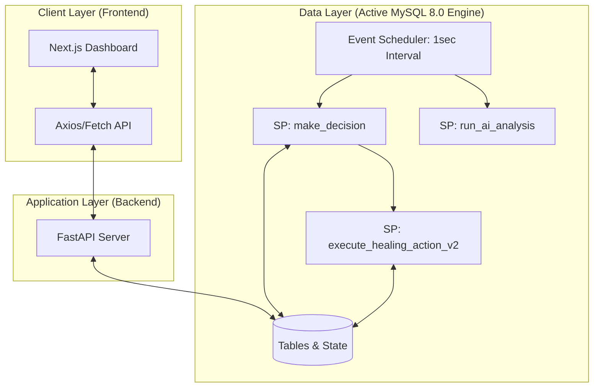
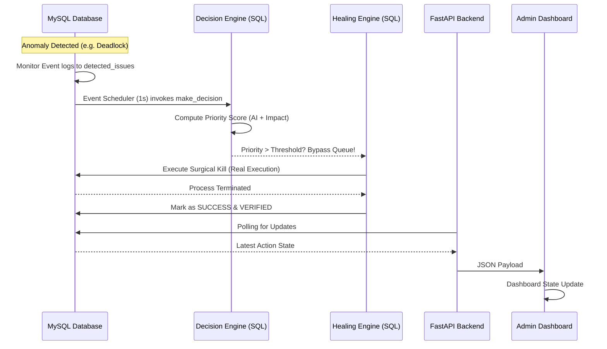
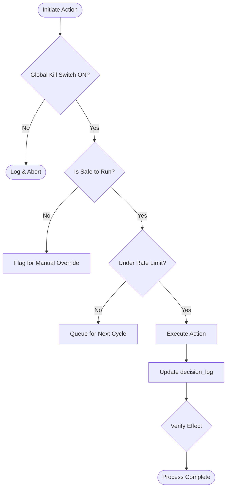

# 🏛️ System Architecture

This document provides a high-level technical overview of the **AI-Powered DBMS Self-Healing Engine**. The system is designed using a decoupled, multi-tier architecture to ensure scalability, safety, and a premium user experience.

---

## 🗺️ System Overview

The system consists of three primary layers:
1.  **Frontend (UI)**: Built with Next.js 14, providing a real-time monitoring and administrative control dashboard.
2.  **Backend (API)**: A FastAPI-driven service that serves as the read-only REST interface bridging the database and the UI.
3.  **Database (Storage & Active Engine)**: A MySQL 8.0 instance containing the data schema, historical logs, and the **Event Scheduler** which natively orchestrates the zero-latency healing process.

### 🏗️ Architecture Diagram

### ⚡ Dynamic Interaction Sequence

The following sequence diagram illustrates the lifecycle of a **High-Confidence Auto-Healing** event:

---

## 💻 Technology Stack

| Layer | Technology | Role |
| :--- | :--- | :--- |
| **Frontend** | [Next.js 14](https://nextjs.org/) | React framework for the dashboard UI. |
| **Styling** | [Tailwind CSS](https://tailwindcss.com/) | Utility-first CSS for glassmorphism and modern design. |
| **Backend** | [FastAPI](https://fastapi.tiangolo.com/) | High-performance Python API framework. |
| **Database** | [MySQL 8.0](https://www.mysql.com/) | Relational database with trigger-based detection. |
| **Validation** | [Pydantic](https://docs.pydantic.dev/) | Type safety and data validation for API payloads. |
| **ORM** | [SQLAlchemy](https://www.sqlalchemy.org/) | SQL Toolkit and Object Relational Mapper. |

---

## 🔄 Core Data Flow

The lifecycle of an anomaly resolution follows this deterministic path:

1.  **Detection**: Database events or external agents log anomalies into the `detected_issues` table.
2.  **Analysis**: `run_ai_analysis` normalizes metrics into Z-scores.
3.  **Decision**: The **Decision Engine** calculates a dynamic Priority Score `[0, 1]` based on Severity (30%), AI Confidence (20%), and System Impact (50%).
4.  **Pivot**:
    - **Auto-Heal**: If the issue is active and authorized, it completely bypasses async queues for **zero-latency immediate execution**.
    - **Admin Review**: If DB metrics indicate a false positive or low impact, it drops to `ADMIN_REVIEW`.
5.  **Resolution**: Real surgical operations (like `KILL <pid>`) are performed. `validate_issue_state` verifies the fix.

---

## 🔒 Safety & Isolation

To prevent accidental data corruption while acting on live production threads:
- **Surgical Execution**: The engine does not rollback random processes. It actively maps `sys.innodb_lock_waits` to exact `trx_mysql_thread_id` PIDs to ensure only the strictly blocking transaction is killed.
- **Iterative Relief**: During connection overloads, the engine iteratively kills the top blocking queries one by one until the active query count safely drops below a predefined threshold, avoiding mass blind kills.
- **Race Condition Guards**: A 10-second staleness check prevents the engine from "fighting ghosts" by aborting kills on issues that have already cleared naturally.

### 🛡️ Safety Guard Flowchart

Before any action is taken, the system passes through a multi-tier safety validation:

