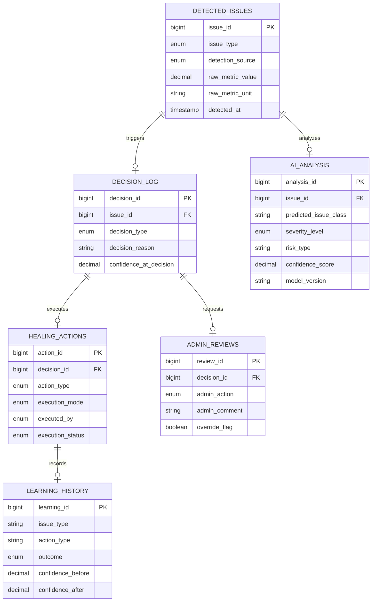

# 🗄️ Database Design & Schema

This project relies on a highly structured relational schema that not only stores application data but also acts as the source-of-truth for the **Self-Healing Engine**.

---

## 📊 Entity Relationship Diagram (ERD)

The following diagram illustrates how issue detection propagates through the analysis and decision layers.

---

## 🏗️ Table Specifications

### 1. `detected_issues`
The landing table for all system anomalies.
- **Key Columns**: `issue_type` (`DEADLOCK`, `SLOW_QUERY`, etc.) and `detection_source`.
- **Purpose**: Permanent audit log of every anomaly caught by the monitoring triggers.

### 2. `ai_analysis`
Stores the output of the classification engine.
- **Key Columns**: `severity_level` (LOW/MEDIUM/HIGH) and `confidence_score`.
- **Purpose**: Provides the "Brain" metadata for the Decision Engine to act upon.

### 3. `decision_log`
The "Command & Control" table.
- **Key Columns**: `decision_type` (`AUTO_HEAL` or `ADMIN_REVIEW`).
- **Purpose**: Tracks what the system *intended* to do for every detected issue.

### 4. `healing_actions`
Logs the *execution* of the recovery.
- **Key Columns**: `execution_status` (`SUCCESS`/`FAILED`).
- **Purpose**: Tracks the actual outcome of automated repairs.

---

## ⚡ SQL Triggers & Automation

The database provides native automation to bridge these tables.

### `after_issue_insert`
Automatically populates the `decision_log` immediately after a new issue is detected.
- **Logic**: 
  - If `DEADLOCK` -> Set for `AUTO_HEAL`.
  - Else -> Set for `ADMIN_REVIEW`.

### `after_decision_insert`
Creates an entry in `admin_reviews` if the decision was routed to a human, or `healing_actions` if it was routed to the engine.

---

## 🔒 Integrity Constraints
- **Foreign Keys**: Cascading deletes are enforced across `issue_id` and `decision_id` to prevent orphaned metadata.
- **Enums**: Strict enums at the DB layer prevent invalid "Healing Statuses" from being injected via the API.
