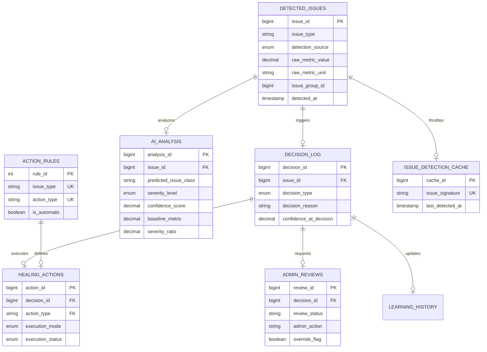

# 🗄️ Database Design & Schema

This project relies on a highly structured relational schema that not only stores application data but also acts as the source-of-truth for the **Self-Healing Engine**. The database is not just a passive store; it actively executes complex logic via stored procedures and triggers.

---

## 📊 Entity Relationship Diagram (ERD)

The following diagram illustrates the complete ecosystem, including rule management and cache layers.

---

## 🏗️ Table Specifications

### 1. `action_rules` [NEW]
The manual knowledge base of the system.
- **Purpose**: Map `issue_type` to a specific `action_type`.
- **Throttling**: Defines whether an action can be executed `is_automatic`.

### 2. `ai_analysis`
Stores the output of the classification and statistical engine.
- **Key Columns**: `baseline_metric` (24h average) and `severity_ratio` (Z-score).
- **Purpose**: Normalizes raw metrics into actionable severity levels.

### 3. `admin_reviews`
The gateway for manual intervention.
- **Key Columns**: `review_status` (PENDING/APPROVED/REJECTED).
- **Update Logic**: Now uses `varchar` instead of `enum` for flexibility in manual overrides.

### 4. `issue_detection_cache` [NEW]
- **Purpose**: Prevents "Alert Fatigue" by anchoring detections to unique signatures, ensuring the pipeline isn't flooded with redundant issues.

---

## ⚙️ Stored Procedures & Logic Engine

Unlike traditional DBs, this system executes its core logic within the database layer for maximum performance and atomicity.

| Procedure | Purpose |
| :--- | :--- |
| `run_auto_heal_pipeline` | The main orchestrator that processes pending issues. |
| `run_ai_analysis` | Computes statistical baselines (Z-scores) to determine severity. |
| `make_decision` | Evaluates AI confidence vs Historical Success to choose AUTO vs ADMIN. |
| `execute_healing_action` | Dispatches the recovery command based on the decision. |
| `update_learning` | Adjusts confidence scores for future decisions based on results. |

---

## ⚡ SQL Triggers & Automation

### `run_automatic_detection`
Called externally to poll system state (Live Traffic, Locks, Connections) and populate `detected_issues`.

### `after_decision_insert`
A post-analysis trigger that routes the flow:
- **If AUTO_HEAL**: Immediately invokes `execute_healing_action`.
- **If ADMIN_REVIEW**: Populates the Admin Control Center for human verification.

---

## 🔒 Integrity Constraints
- **Recursive Safety**: `ISSUE_DETECTION_CACHE` ensures that a single SLOW_QUERY doesn't spawn 1000 healing events.
- **Automatic Throttling**: The SQL layer enforces a global limit (max 5 heals/minute) to prevent cascading failures.
