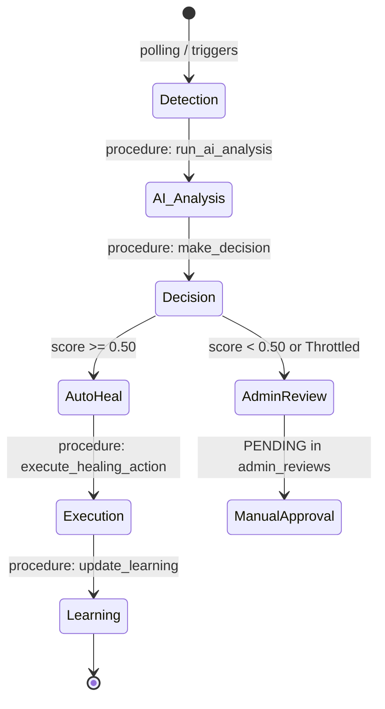

# 🧠 Healing Engine Design

The **Self-Healing Engine** is a deterministic orchestrator that blends statistical analysis with a rule-based expert system. It moves beyond simple "if-else" logic by calculating real-time severity scores and evaluating historical success before taking action.

---

## 🔄 The Self-Healing Lifecycle

The lifecycle is now driven by **Stored Procedures** at the database layer, ensuring atomic state transitions and zero-latency analysis.

---

## 📏 Decision Logic & Statistical Scoring

The engine no longer relies on hardcoded thresholds. Instead, it uses **Z-Score Normalization** to understand how "anomalous" an event is compared to the last 24 hours of data.

### 1. Statistical Severity (Z-Score)
The `compute_severity` procedure calculates the Z-Score of a metric:
$$Z = \frac{x - \mu}{\sigma}$$
*   **CRITICAL**: $Z \ge 3.0$ or $\ge 5$ anomalies in 2 hours.
*   **HIGH**: $Z \ge 2.0$ or $\ge 3$ anomalies in 2 hours.
*   **MEDIUM**: $Z \ge 1.0$.

### 2. Weighted Decision Score
A final decision score (0.0 to 1.0) is calculated in `make_decision` using three vectors:
| Vector | Weight | Logic |
| :--- | :--- | :--- |
| **Severity Weight** | 50% | Maps CRITICAL/HIGH/MEDIUM to 1.0/0.7/0.4. |
| **AI Confidence** | 30% | Normalization of the model's prediction confidence. |
| **Success Factor** | 20% | Historical resolution rate (Success / Total Attempts). |

---

## 🛡️ Safety & Governance

### 🚦 Intelligent Throttling
To prevent the system from entering a feedback loop (where healing actions cause more issues), the engine implements **Concurrency Throttling**:
- **Global Limit**: If more than **5 AUTO_HEAL** actions occur within **60 seconds**, the system automatically forces all subsequent actions into `ADMIN_REVIEW` regardless of confidence.

### 📉 Success Rate Enforcements
- If an action has a historical success rate lower than **30%**, the engine will refuse to execute it automatically.
- If a **CRITICAL** issue has a success rate lower than **20%**, it is hard-blocked to prevent further damage.

---

## 🛠️ Procedural Components

### 1. The Orchestrator (`run_auto_heal_pipeline`)
Polls the `detected_issues` table for unanalyzed events and batches them (max 50) for processing. It uses a **Global Mutex Lock** (`GET_LOCK`) to ensure multiple database threads don't attempt to heal the same issue simultaneously.

### 2. The Learning Engine (`update_learning`)
After every execution, the system compares the outcome. 
- **Success**: Increases future confidence for that `issue_type` + `action_type` pair by **5%**.
- **Failure**: Decreases future confidence by **5%**, eventually forcing poor-performing rules into manual review.
