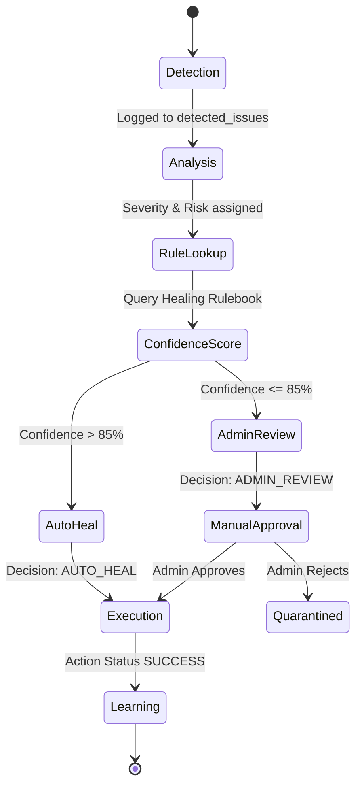

# 🧠 Healing Engine Design

The **Self-Healing Engine** is a deterministic, rule-based orchestrator designed to resolve DBMS anomalies with maximum safety and auditability.

---

## 🔄 The Self-Healing Lifecycle

When an issue is detected, it flows through a multi-stage pipeline represented by the state machine below.

---

## 📏 Decision Logic & Scoring

The engine uses an internal **Healing Rulebook** (`dbms-backend/app/rules/healing_rulebook.py`) to assign weights to various anomalies.

### Scoring Factors
| Factor | Weight | Description |
| :--- | :--- | :--- |
| **Detection Source** | 30% | `PERFORMANCE_SCHEMA` events are weighted higher than generic logs. |
| **Risk Type** | 40% | `CONSISTENCY_RISK` and `SECURITY_RISK` require higher thresholds than `PERFORMANCE`. |
| **Historical Outcome** | 30% | Success rate of past automated repairs for this specific issue type. |

### Confidence Pivot Table
| Confidence | Action | Path |
| :--- | :--- | :--- |
| **0.90 - 1.00** | Urgent Action | Immediate local resolution (e.g., Rollback). |
| **0.75 - 0.89** | Standard Action | Normal automated processing flow. |
| **0.00 - 0.74** | Red Flag | Handled by the **Admin Review Engine**. |

---

## 🛠️ Individual Engines

### 1. Decision Engine
The "Evaluator." It maps incoming `detected_issues` to specific `HealingRules`. It is stateless and idempotent; same inputs consistently yield the same Confidence score.

### 2. Healing Engine
The "Executor." Once a decision is made to `AUTO_HEAL`, this engine generates the remedial SQL or system command. 
- **Currently**: All actions are **Simulated** for safety, recorded in `healing_actions`.

### 3. Admin Review Engine
The "Escalator." For complex issues like `SLOW_QUERY` or `TRANSACTION_FAILURE` (which have many root causes), this engine creates an approval workflow for the human-in-the-loop.

---

## 🛡️ Safety Guards

To prevent the engine from causing "Self-Induced Downtime," we implement strict **Safety Guards**:
- **Blocked Keywords**: Commands like `DROP`, `TRUNCATE`, or `SHUTDOWN` are hard-blocked at the AST level.
- **Retry Backoff**: The engine will not attempt to heal the same `issue_id` more than 3 times.
- **ReadOnly Detection**: The engine can only write to metadata tables (`decision_log`, etc.), never the core application data tables.
