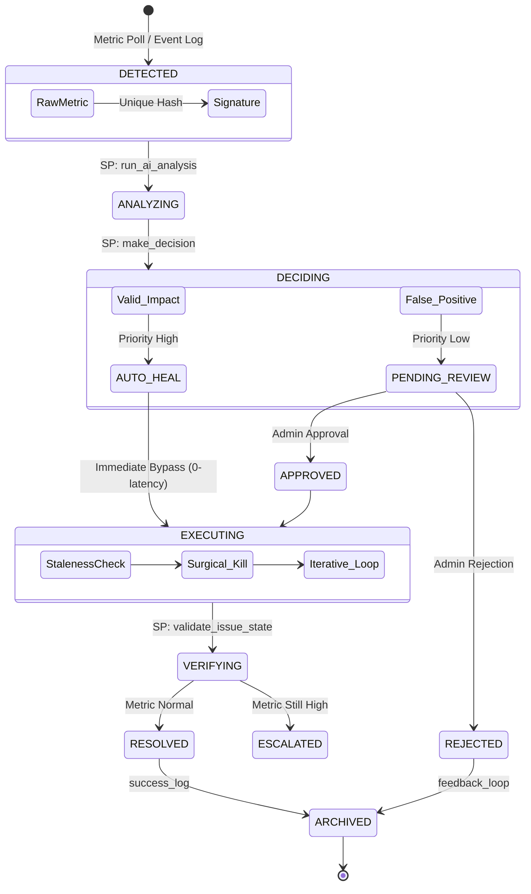

# 🧠 Healing Engine Design

The **Self-Healing Engine** is a deterministic orchestrator that blends statistical analysis with a rule-based expert system. It moves beyond simple "if-else" logic by calculating real-time severity scores and evaluating historical success before taking action.

---

## 🔄 The Self-Healing Lifecycle

The lifecycle is now driven by **Stored Procedures** at the database layer, ensuring atomic state transitions and zero-latency analysis.

### 🔄 Healing Lifecycle State Machine

The following state diagram illustrates the complex transitions an anomaly undergoes from detection to permanent archival.



---

## 📏 Decision Logic & Statistical Scoring

The engine no longer relies on hardcoded thresholds. Instead, it uses **Z-Score Normalization** to understand how "anomalous" an event is compared to the last 24 hours of data.

### 1. Statistical Severity (Z-Score)
The `compute_severity` procedure calculates the Z-Score of a metric:
$$Z = \frac{x - \mu}{\sigma}$$
*   **CRITICAL**: $Z \ge 3.0$ or $\ge 5$ anomalies in 2 hours.
*   **HIGH**: $Z \ge 2.0$ or $\ge 3$ anomalies in 2 hours.
*   **MEDIUM**: $Z \ge 1.0$.

### 🧠 Decision Scoring Logic (Phase 7)

The scoring engine calculates a **Dynamic Priority Score** (`[0, 1]`) by aggregating statistical severities, AI confidence, and real-time system impact.

```mermaid
flowchart TD
    Anom([New Anomaly]) --> Rules{Extract Vectors}
    
    Rules --> AI[AI Confidence Z-Score: 20%]
    Rules --> Sev[Base Severity: 30%]
    Rules --> Sys[System Impact: 50%]
    
    AI --> Calc[Weighted Sum Calculation]
    Sev --> Calc
    Sys --> Calc
    
    Calc --> Final{Validation Check}
    
    Final -- "DB State Clear" --> Review[ADMIN_REVIEW]
    Final -- "Issue Exists" --> Auto[AUTO_HEAL (Immediate Execution)]
```

---

## 🛡️ Safety & Governance

### 🚦 Intelligent Throttling
To prevent the system from entering a feedback loop (where healing actions cause more issues), the engine implements **Concurrency Throttling**:
- **Global Limit**: If more than **5 AUTO_HEAL** actions occur within **60 seconds**, the system automatically forces all subsequent actions into `ADMIN_REVIEW` regardless of confidence.

### 📉 Success Rate Enforcements
- If an action has a historical success rate lower than **30%**, the engine will refuse to execute it automatically.
- If a **CRITICAL** issue has a success rate lower than **20%**, it is hard-blocked to prevent further damage.

---

### 1. The Orchestrator (`run_auto_heal_pipeline`)
Triggered **every 1 second** by the MySQL Event Scheduler, this procedure polls the `detected_issues` table for unanalyzed events. It immediately cascades into AI analysis and decision making to ensure near-zero latency.

### 2. The Execution Engine (`execute_healing_action_v2`)
The core action engine capable of real-world surgical database modifications:
- **Iterative Relief**: For `CONNECTION_OVERLOAD`, it iteratively kills the top CPU-consuming queries until active connection counts stabilize below a safe threshold, preventing mass blind-kills.
- **Surgical Deadlock Kills**: Scans `sys.innodb_lock_waits` to map waiting locks precisely to the blocking `trx_mysql_thread_id`, terminating only the single rogue process.
- **Race Guard**: Implements a strict timestamp check (`TIMESTAMPDIFF`) to abort executions if the issue is older than 10 seconds, preventing the system from "fighting ghosts".
