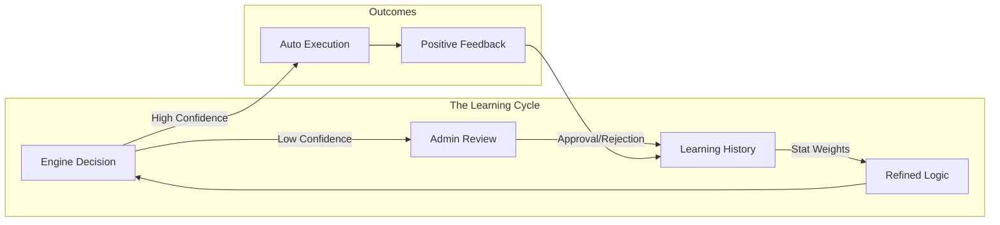

# The Self-Healing Engine

At the core of this project is a Dual-Engine Self-Healing module that detects database anomalies and decides if the system should automatically heal the issue, or if the issue requires advanced manual Admin Review.

## Anomaly Detection Criteria
The backend pipeline categorizes an incoming anomaly through simulated AI triggers matching real-world SQL metrics:
- **DEADLOCK**: Evaluated as `CRITICAL`. Typically yields a `0.90` to `0.99` Confidence factor. System routes to **AUTO_HEAL**.
- **CONNECTION_OVERLOAD**: Evaluated as `HIGH`. Confidence `0.85`. System attempts **KILL_CONNECTION** immediately.
- **TRANSACTION_FAILURE**: Evaluated as `MEDIUM`. Too ambiguous for auto-heal. Sent to **ADMIN_REVIEW** grid.
- **SLOW_QUERY**: Evaluated as `LOW`. Sent to **ADMIN_REVIEW** with a `KILL_QUERY` or `IGNORE` recommended action.

## Flow of Healing Logic
1. Wait for database payload inserting into `detected_issues`.
2. Model classifies severity into `ai_analysis`.
3. `confidence_score` determines the pivot:
   - `> 0.85` -> Proceed to `healing_actions`.
   - `< 0.85` -> Create record in `admin_reviews`.
4. The React User Interface acts as the monitoring and override interface for pending decisions.

### 🔄 Human-in-the-Loop Learning Loop

The system evolves through continuous feedback from administrators. Every manual action refines the engine's future reliability.

